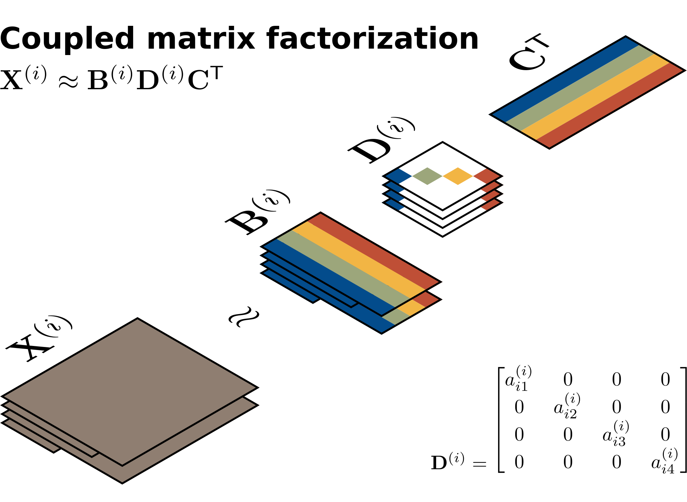
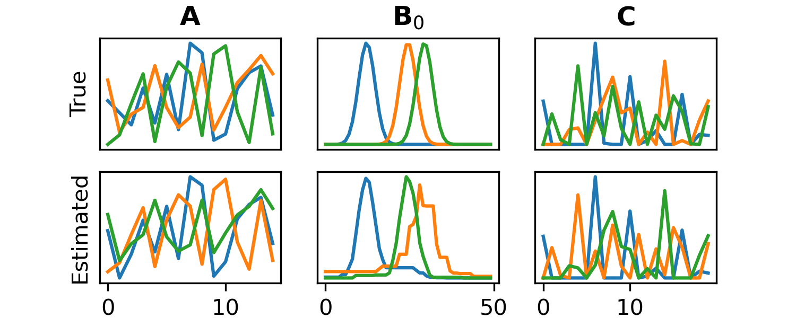

=========
MatCoupLy
=========
*Learning coupled matrix factorizations with Python*

.. image:: https://github.com/MarieRoald/matcouply/actions/workflows/Tests.yml/badge.svg
    :target: https://github.com/MarieRoald/matcouply/actions/workflows/Tests.yml
    :alt: Tests

.. image:: https://codecov.io/gh/MarieRoald/matcouply/branch/main/graph/badge.svg?token=GDCXEF2MGE
    :target: https://codecov.io/gh/MarieRoald/matcouply
    :alt: Coverage

.. image:: https://readthedocs.org/projects/matcouply/badge/?version=latest
        :target: https://matcouply.readthedocs.io/en/latest/?badge=latest
        :alt: Documentation Status
    
.. image:: https://img.shields.io/badge/code%20style-black-000000.svg
    :target: https://github.com/psf/black

MatCoupLy is a Python library for learning coupled matrix factorizations with flexible constraints and regularization with Python.

Installation
------------

To install MatCoupLy and all MIT-compatible dependencies from PyPI, you can run

.. code::

        pip install matcouply
        
If you also want to enable total variation regularization, you need to install all components, which comes with a GPL-v3 lisence

.. code::

        pip install matcouply[all]

About
-----

MatCoupLy is a Python library that adds support for coupled matrix factorization in 
[TensorLy](https://github.com/tensorly/tensorly/). For optimization, MatCoupLy uses
alternating updates with the alternating direction method of multipliers (AO-ADMM),
which allows you to fit coupled matrix factorization (and PARAFAC2) models with flexible
constraints in any mode of your data [1, 2]. Currently, MatCoupLy supports the NumPy and
PyTorch backends of TensorLy.

Example
-------

Below is a simulated example, where a set of 15 non-negative coupled matrices are generated and
decomposed using a non-negative PARAFAC2 factorization with an L1 penalty on **C**, constraining
the maximum norm of the **A** and **Bᵢ** matrices and unimodality constraints on the component
vectors in the **Bᵢ** matrices. For more examples, see the `Gallery of examples <https://matcouply.readthedocs.io/en/latest/auto_examples/index.html>`_
in the `online documentation <https://matcouply.readthedocs.io/en/latest/index.html>`_.

.. code:: python

    import matplotlib.pyplot as plt
    import numpy as np
    import scipy.stats as stats
    import tensorly as tl

    from matcouply.data import get_simple_simulated_data
    from matcouply.decomposition import cmf_aoadmm

    noisy_matrices, cmf = get_simple_simulated_data(noise_level=0.2, random_state=1)
    rank = cmf.rank
    weights, (A, B_is, C) = cmf

    # Decompose the dataset
    estimated_cmf = cmf_aoadmm(
        noisy_matrices,
        rank=rank,
        non_negative=True,  # Constrain all components to be non-negative
        l1_penalty={2: 0.1},  # Sparsity on C
        l2_norm_bound=[1, 1, 0],  # Norm of A and B_i-component vectors less than 1
        parafac2=True,  # Enforce PARAFAC2 constraint
        unimodal={1: True},  # Unimodality (one peak) on the B_i component vectors
        constant_feasibility_penalty=True,  # Must be set to apply l2_norm_penalty (row-penalty) on A. See documentation for more details
        verbose=-1,  # Negative verbosity level for minimal (nonzero) printouts
        random_state=0,  # A seed can be given similar to how it's done in TensorLy
    )

    est_weights, (est_A, est_B_is, est_C) = estimated_cmf

    # Code to display the results
    def normalize(M):
        return M / np.linalg.norm(M, axis=0)

    fig, axes = plt.subplots(2, 3, figsize=(5, 2))
    axes[0, 0].plot(normalize(A))
    axes[0, 1].plot(normalize(B_is[0]))
    axes[0, 2].plot(normalize(C))

    axes[1, 0].plot(normalize(est_A))
    axes[1, 1].plot(normalize(est_B_is[0]))
    axes[1, 2].plot(normalize(est_C))

    axes[0, 0].set_title(r"$\mathbf{A}$")
    axes[0, 1].set_title(r"$\mathbf{B}_0$")
    axes[0, 2].set_title(r"$\mathbf{C}$")

    axes[0, 0].set_ylabel("True")
    axes[1, 0].set_ylabel("Estimated")

    for ax in axes.ravel():
        ax.set_yticks([])  # Components can be aribtrarily scaled
    for ax in axes[0]:
        ax.set_xticks([])  # Remove xticks from upper row

    plt.savefig("figures/readme_components.png", dpi=300)

.. code:: raw

    Added mode 0 penalties and constraints:    
    * L2 ball constraint (with non-negativity)
    Added mode 1 penalties and constraints:
    * PARAFAC2
    * Unimodality constraint (with non-negativity)
    * L2 ball constraint (with non-negativity)
    Added mode 2 penalties and constraints:
    * L1 penalty (with non-negativity)
    converged in 175 iterations: FEASIBILITY GAP CRITERION AND RELATIVE LOSS CRITERION SATISFIED

References
----------

 * [1]: Roald M, Schenker C, Cohen JE, Acar E. PARAFAC2 AO-ADMM: Constraints in all modes. EUSIPCO (2021).
 * [2]: Roald M, Schenker C, Bro R, Cohen JE, Acar E. An AO-ADMM approach to constraining PARAFAC2 on all modes (2021). arXiv preprint arXiv:2110.01278.
